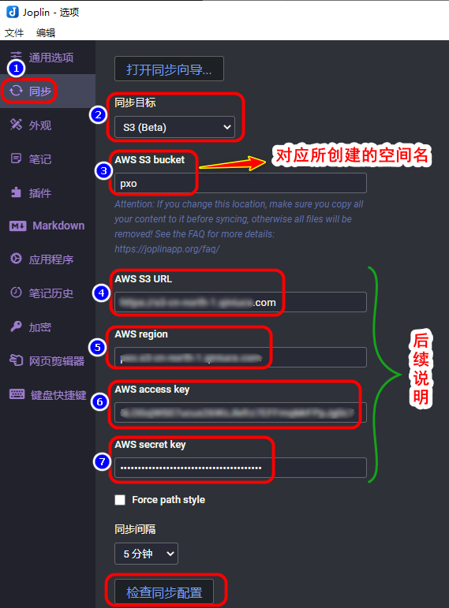
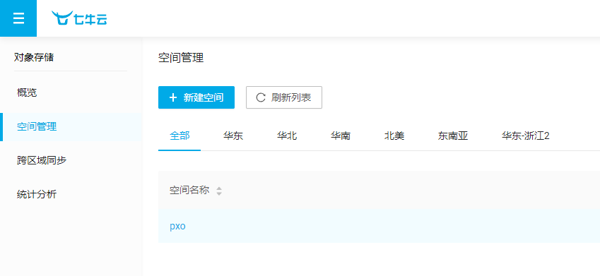
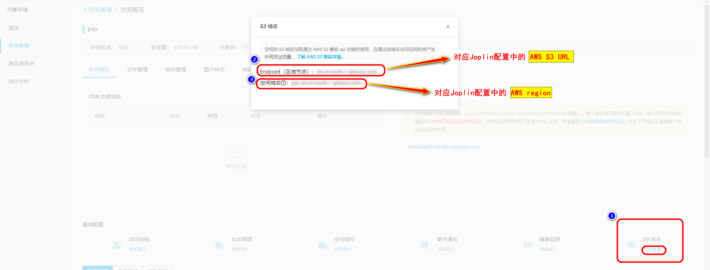
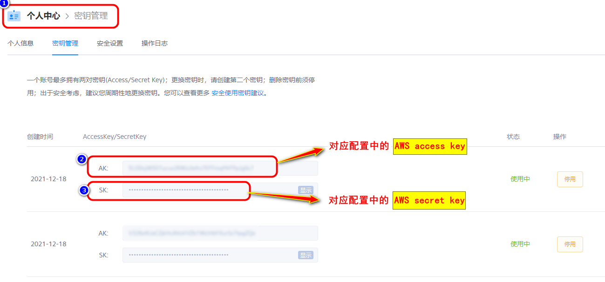

# Joplin 使用 七牛云进行同步

[toc]

## 注意：
- 还是留一手，经常导出、备份到云盘。
- 以防误删后点击同步 导致所有数据都没了。

## 0、 Joplin 配置页

- 选择 S3(Beta)
- AWS S3 bucket
- ...

## 1、注册七牛云账号 <https://portal.qiniu.com/>

## 2、 新建空间

## 3、进入空间，获取相关信息

- 点击进入空间
- 查看 S3 域名
- 获取途中两个信息，填到 Joplin 对应配置中

## 4、个人中心、密匙管理

- 进入个人中心
- 获得两个 key。填到对应位置

## 5、配置完成

- 配置完成后，可以点击**检查同步配置**，查看是否配置成功

